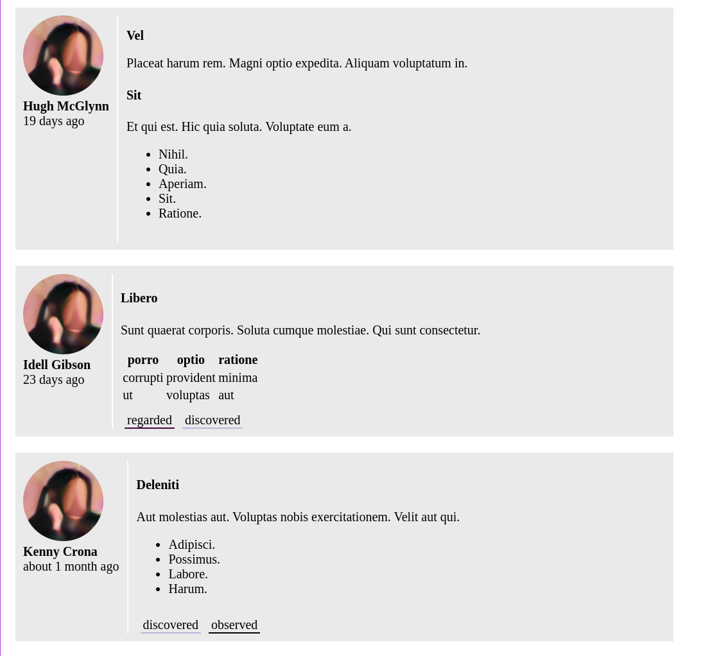

# Glowflake





Note on the [architecture](./ARCHITECTURE.md).


### Database setup

```shell
rails db:reset
rails db:generate_sample_data
```


### Running

From the Nix shell:

```shell
npm i
bundle exec -- foreman start -f Procfile.dev
```

Then open: <http://localhost:5005/>.


### Trivia

- (Auto)-Formatting with `rubocop -A`
- Look in the database with `sqlitebrowser storage/development.sqlite3`


### Notes

**Plan**

- [x] Work status updates
- [x] People
- [x] Minimal information in an update: sentence or two, labels, date.
- [x] ~List of updates by label~ Just listing the updates and the labels.


**Todo**

- [x] Document architecture approaches
- [x] Basic rails site
- [x] Nix setup
- [x] React page to view them
- [x] Sample data to make a bunch
- [x] Simple REST api for updates
- [x] Very simple db structure: people, updates, tags
- [x] ~Process-Compose~ Just using foreman.


**Optional todo**

- [ ] Login with some kind of oauth
- [ ] Editing updates
- [ ] Emoji reactions
- [ ] ???
- [1/2] Tidying up the REST api so it's more efficient (see <https://github.com/silky/glowflake/pull/3>). This is partially resolved, but certainly there's more to do if one wished.

